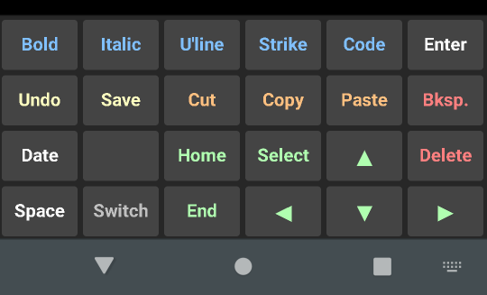

# Android Editing Keyboard

## What It Is

This is a custom Android keyboard with editing and formatting functions, that I put together for personal use back in the days before Google's own Android keyboard had editing keys.
Mostly it works by sending Ctrl-*letter* keystrokes. Some of these are pretty widely recognised (bold, italic, cut & paste, etc), others are peculiar to certain software that I use, so probably won't be much use to anyone else.

## How To Use It

If for some reason you want to use it as-is:

1. Sideload the `.apk` file.
2. Go to *Settings > System > Languages & Input > On-screen Keyboard > Manage On-screen Keyboards* and activate *atg1wt Editing Keyboard*.
3. You will get a scary warning about how this keyboard might collect all the text you type, buy you a warehouse full of pink leotards, cause a major rift in time and space, etc. Are you sure you trust me? Like, *really* sure? Well, go on then, hit *OK*.
4. You can switch between this and any other input methods you have installed using the little keyboard icon in the bottom-right corner of the screen, or whatever other keyboard-switching methods Android is offering this week.

If you want to play with the source code:

1. Open the project in Android Studio.
2. Play with the source code.
3. Compile and run it on your Android device.
4. Go to *Settings > System > Languages & Input > On-screen Keyboard > Manage On-screen Keyboards* and activate *atg1wt Editing Keyboard*.
5. You _did_ read all the source to make sure it doesn't do anything terrible, right? Then hit *OK*.
6. You can switch between this and any other input methods you have installed using the little keyboard icon in the bottom-right corner of the screen, or whatever other keyboard-switching methods Android is offering this week.

## Known Issues

- It was made for a phone in portrait mode, it probably won't look great on a larger device or in landscape mode.
- Hardcoding everything is annoying, I should add a configuration screen to change key functions and labels.

## License

Code is copyright by Tyrone C. and made available under the MIT license, the text of which can be found in the LICENSE.md file in this repository.
